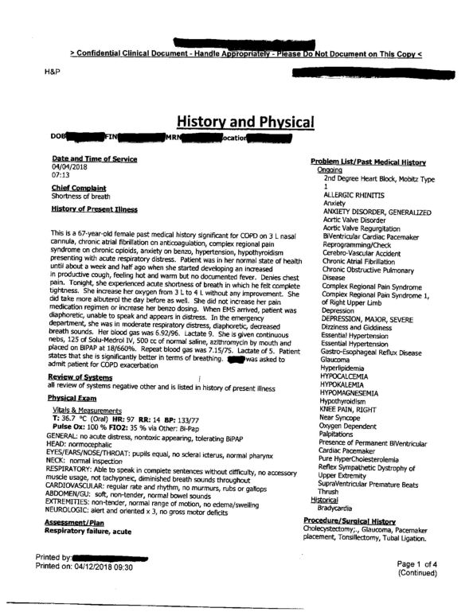

## Description

Deidentification NER (Large) is a Named Entity Recognition model that annotates text to find protected health information that may need to be deidentified. The entities it annotates are `Age`, `Contact`, `Date`, `Id`, `Location`, `Name`, and `Profession`. This model is trained with the `embeddings_clinical` word embeddings model, so be sure to use the same embeddings in the pipeline.

It protects specific health information that could identify living or deceased individuals.  The rule preserves patient confidentiality without affecting the values and the information that could be needed for different research purposes.

## Predicted Entities

{:.btn-box}
<button class="button button-orange" disabled>Live Demo</button>
[Open in Colab](https://github.com/JohnSnowLabs/spark-ocr-workshop/blob/master/tutorials/Certification_Trainings/3.1.SparkOcrImageDeIdentification.ipynb){:.button.button-orange.button-orange-trans.co.button-icon}
[Download](https://s3.amazonaws.com/auxdata.johnsnowlabs.com/clinical/models/ner_deid_large_en_3.0.0_3.0_1617209688468.zip){:.button.button-orange.button-orange-trans.arr.button-icon}

## How to use


<div class="tabs-box" markdown="1">

```python
    
    from pyspark.ml import PipelineModel
    from sparkocr.transformers import *

    imagePath = "path to image"
    bin_df = spark.read.format("binaryFile").load(imagePath)

    def deidentification_nlp_pipeline(input_column, prefix = ""):
        document_assembler = DocumentAssembler() \
            .setInputCol(input_column) \
            .setOutputCol(prefix + "document")
    
        # Sentence Detector annotator, processes various sentences per line
        sentence_detector = SentenceDetector() \
            .setInputCols([prefix + "document"]) \
            .setOutputCol(prefix + "sentence")
    
        tokenizer = Tokenizer() \
            .setInputCols([prefix + "sentence"]) \
            .setOutputCol(prefix + "token")
    
        # Clinical word embeddings
        word_embeddings = WordEmbeddingsModel.pretrained("embeddings_clinical", "en", "clinical/models") \
            .setInputCols([prefix + "sentence", prefix + "token"]) \
            .setOutputCol(prefix + "embeddings")
            
        # NER model trained on i2b2 (sampled from MIMIC) dataset
        clinical_ner = MedicalNerModel.pretrained("ner_deid_large", "en", "clinical/models") \
            .setInputCols([prefix + "sentence", prefix + "token", prefix + "embeddings"]) \
            .setOutputCol(prefix + "ner")
    
        custom_ner_converter = NerConverter() \
            .setInputCols([prefix + "sentence", prefix + "token", prefix + "ner"]) \
            .setOutputCol(prefix + "ner_chunk") \
            .setWhiteList(['NAME', 'AGE', 'CONTACT', 'LOCATION', 'PROFESSION', 'PERSON', 'DATE'])
    
        nlp_pipeline = Pipeline(stages=[
                document_assembler,
                sentence_detector,
                tokenizer,
                word_embeddings,
                clinical_ner,
                custom_ner_converter
            ])
        empty_data = spark.createDataFrame([[""]]).toDF(input_column)
        nlp_model = nlp_pipeline.fit(empty_data)
        return nlp_model

    # Convert to images
    binary_to_image = BinaryToImage() \
        .setInputCol("content") \
        .setOutputCol("image_raw")
    
    # Extract text from image
    ocr = ImageToText() \
        .setInputCol("image_raw") \
        .setOutputCol("text") \
        .setIgnoreResolution(False) \
        .setPageIteratorLevel(PageIteratorLevel.SYMBOL) \
        .setPageSegMode(PageSegmentationMode.SPARSE_TEXT) \
        .setConfidenceThreshold(70)
    
    # Found coordinates of sensitive data
    position_finder = PositionFinder() \
        .setInputCols("ner_chunk") \
        .setOutputCol("coordinates") \
        .setPageMatrixCol("positions") \
        .setMatchingWindow(1000) \
        .setPadding(1)
    
    # Draw filled rectangle for hide sensitive data
    drawRegions = ImageDrawRegions()  \
        .setInputCol("image_raw")  \
        .setInputRegionsCol("coordinates")  \
        .setOutputCol("image_with_regions")  \
        .setFilledRect(True) \
        .setRectColor(Color.gray)
        
    # OCR pipeline
    pipeline = Pipeline(stages=[
        binary_to_image,
        ocr,
        deidentification_nlp_pipeline(input_column="text"),
        position_finder,
        drawRegions
    ])
    
    result = pipeline.fit(image_df).transform(image_df).cache()
```
```scala
import com.johnsnowlabs.ocr.transformers.*
import com.johnsnowlabs.ocr.OcrContext.implicits._

val imagePath = "path to image"
var dataFrame = spark.read.format("binaryFile").load(imagePath)

val pdf_to_image = new PdfToImage()
      .setInputCol("content")
      .setOutputCol("image")
      .setKeepInput(true)

val image_to_text = new ImageToText()
      .setInputCol("image")
      .setOutputCol("text").setIgnoreResolution(false)
      .setConfidenceThreshold(10)
      .setPageIteratorLevel(PageIteratorLevel.SYMBOL)
      .setPageSegMode(PageSegmentationMode.SPARSE_TEXT_OSD)

val document_assembler = new DocumentAssembler()
      .setInputCol("text")
      .setOutputCol("document")

val sentence_detector = new SentenceDetector()
      .setInputCols(Array("document"))
      .setOutputCol("sentence")

val tokenizer = new Tokenizer()
      .setInputCols(Array("sentence"))
      .setOutputCol("token")

val word_embeddings = WordEmbeddingsModel.pretrained("embeddings_clinical", "en", "clinical/models")
      .setInputCols(Array("sentence", "token"))
      .setOutputCol("embeddings")

val clinical_ner = NerDLModel.pretrained("ner_deid_large", "en", "clinical/models")
      .setInputCols(Array("sentence","token","embeddings"))
      .setOutputCol("ner")

val custom_ner_converter = new NerConverter()
      .setInputCols(Array("sentence", "token","ner"))
      .setOutputCol("ner_chunk")

//FInd coordinates of ner_chunks
val position_finder = new PositionFinder()
      .setInputCols("ner_chunk")
      .setOutputCol("coordinates")
      .setPageMatrixCol("positions")
      .setMatchingWindow(10)
      .setPadding(2)

//Draw filled rectangle for hide sensitive data
val drawRegions = new ImageDrawRegions()
      .setInputCol("image")
      .setInputRegionsCol("coordinates")
      .setOutputCol("image_with_regions")
      .setFilledRect(false)

val pipeline = new Pipeline()
      .setStages(Array(
                      pdf_to_image,
                      image_to_text,
                      document_assembler,
                      sentence_detector,
                      tokenizer,
                      word_embeddings,
                      clinical_ner,
                      custom_ner_converter,
                      position_finder,
                      drawRegions
                          ))

val data = pipeline.fit(dataFrame).transform(dataFrame).cache()
data.select("positions", "ner_chunk", "pagenum" ).write.parquet(path)
```
</div>

## Example

### Input:


### Output:

```bash
+------------------------------------------------------------------------------------------------------------------------------------------------------------------------------------------------------------------------------------------------------------------------------------------------------------+
|ner_chunk                                                                                                                                                                                                                                                                                                   |
+------------------------------------------------------------------------------------------------------------------------------------------------------------------------------------------------------------------------------------------------------------------------------------------------------------+
|[{chunk, 193, 202, 04/04/2018, {entity -> DATE, sentence -> 1, chunk -> 0, confidence -> 0.9999}, []}, {chunk, 3290, 3290, ., {entity -> NAME, sentence -> 17, chunk -> 1, confidence -> 0.6035}, []}, {chunk, 3388, 3397, 04/12/2018, {entity -> DATE, sentence -> 20, chunk -> 2, confidence -> 1.0}, []}]|
+------------------------------------------------------------------------------------------------------------------------------------------------------------------------------------------------------------------------------------------------------------------------------------------------------------+
```

## Model Information

{:.table-model}
|---|---|
|Model Name:|ner_clinical_large|
|Compatibility:|Healthcare NLP 3.0.0+|
|License:|Licensed|
|Edition:|Official|
|Input Labels:|[sentence, token, embeddings]|
|Output Labels:|[ner]|
|Language:|en|

## Data Source

Trained on augmented 2010 i2b2 challenge data with 'embeddings_clinical'.
https://portal.dbmi.hms.harvard.edu/projects/n2c2-nlp/

## Benchmarking

```bash
        label        tp     fp     fn      prec       rec        f1 
  I-TREATMENT      6625   1187   1329  0.848054  0.832914  0.840416 
    I-PROBLEM     15142   1976   2542  0.884566  0.856254   0.87018  
    B-PROBLEM     11005   1065   1587  0.911765  0.873968  0.892466 
       I-TEST      6748    923   1264  0.879677  0.842237   0.86055  
       B-TEST      8196    942   1029  0.896914  0.888455  0.892665 
  B-TREATMENT      8271   1265   1073  0.867345  0.885167  0.876165 
Macro-average     55987   7358   8824  0.881387  0.863166  0.872181 
Micro-average     55987   7358   8824  0.883842   0.86385  0.873732 
```


