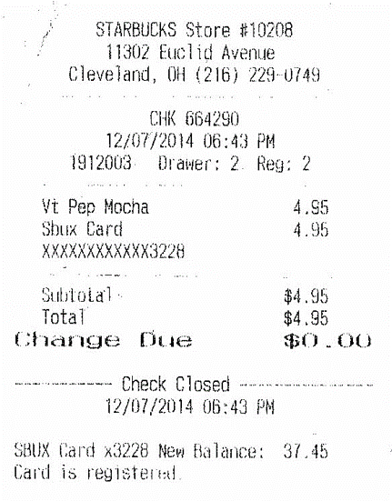
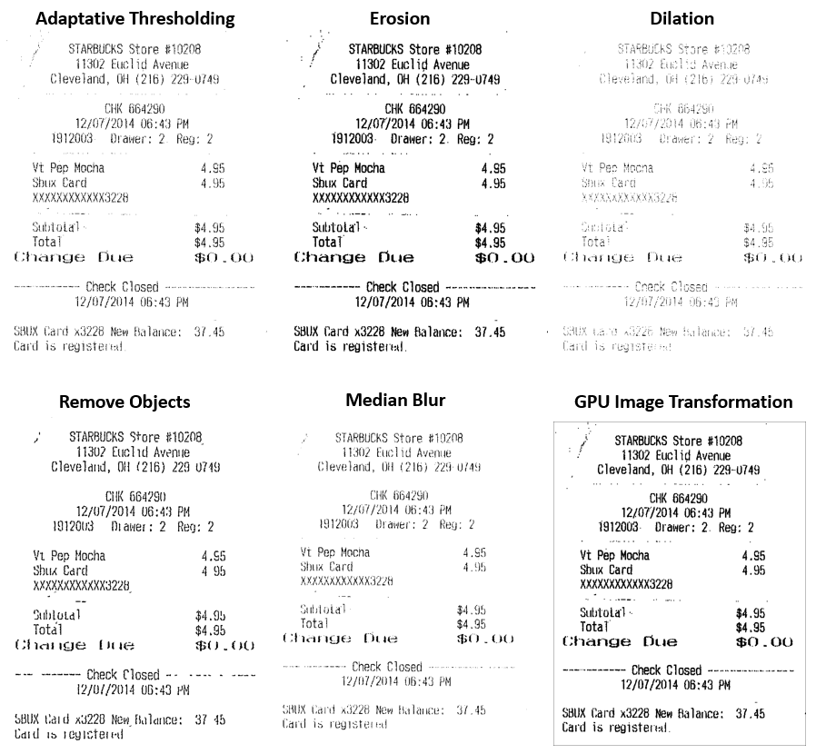

## Description

The processing of documents for the purpose of discovering  knowledge from them in an automated fashion is a challenging task and hence an open issue for the research community. In this work, it is proposed the use of different image processing algorithms apply to documents to improve its quality to improve the performance of the next step of computer vision algorithms as text detection, text recognition, ocr, table detection... These image processing algorithms are: scale image, adaptive thresholding, erosion, dilation, remove objects, median blur and gpu image transformation.

## Predicted Entities

{:.btn-box}
<button class="button button-orange" disabled>Live Demo</button>
[Open in Colab](https://github.com/JohnSnowLabs/spark-ocr-workshop/blob/master/tutorials/Certification_Trainings/1.2.Image_processing.ipynb){:.button.button-orange.button-orange-trans.co.button-icon}
<button class="button button-orange" disabled>Download</button>

## How to use


<div class="tabs-box" markdown="1">

```python
    
    from pyspark.ml import PipelineModel
    from sparkocr.transformers import *
    
    imagePath = "path to image"
    bin_df = spark.read.format("binaryFile").load(imagePath)
    
    scaled_image_df = ImageTransformer() \
        .addScalingTransform(2) \
        .setInputCol("image") \
        .setOutputCol("scaled_image") \
        .setImageType(ImageType.TYPE_BYTE_GRAY) \
        .transform(image_df)

    thresholded_image = ImageTransformer() \
        .addAdaptiveThreshold(21, 20)\
        .setInputCol("image") \
        .setOutputCol("thresholded_image") \
        .transform(image_df)

    eroded_image = ImageTransformer() \
        .addErodeTransform(2,2)\
        .setInputCol("image") \
        .setOutputCol("eroded_image") \
        .transform(image_df)

    dilated_image = ImageTransformer() \
          .addDilateTransform(1, 2)\
          .setInputCol("image") \
          .setOutputCol("dilated_image") \
          .transform(image_df)

    removebg_image = ImageTransformer() \
        .addScalingTransform(2) \
        .addAdaptiveThreshold(31, 2)\
        .addRemoveObjects(10, 500) \
        .setInputCol("image") \
        .setOutputCol("corrected_image") \
        .transform(image_df)

    deblured_image = ImageTransformer() \
        .addScalingTransform(2) \
        .addMedianBlur(3) \
        .setInputCol("image") \
        .setOutputCol("corrected_image") \
        .transform(image_df)

    multiple_image = GPUImageTransformer() \
        .addScalingTransform(8) \
        .addOtsuTransform() \
        .addErodeTransform(3, 3) \
        .setInputCol("image") \
        .setOutputCol("multiple_image") \
        .transform(image_df)

    display_images(thresholded_image, "Adaptative Thresholding")
    display_images(eroded_image, "Erosion")
    display_images(dilated_image, "Dilation")
    display_images(removebg_imageremovebg_image, "Remove Objects")
    display_images(deblured_image, "Median Blur")
    display_images(multiple_image, "GPU Image Transformation")
```
```scala
import com.johnsnowlabs.ocr.transformers.*
import com.johnsnowlabs.ocr.OcrContext.implicits._

val imagePath = "path to image"
var dataFrame = spark.read.format("binaryFile").load(imagePath)

val transformer = new ImageTransformer()
  .setInputCol("image")
  .setOutputCol("transformed_image")
  .addScalingTransform(0.5)
  .addOtsuTransform()
  .addBlur(3)
  .addRemoveObjects(10, 500)
  .addMedianBlur(3)
  .addErodeTransform(3, 3)
  .addDilateTransform(3, 3)

val reuslt = transformer.transform(dataFrame).select("image", "transformed_image").cache()
```
</div>

## Example

### Input:


### Output:


