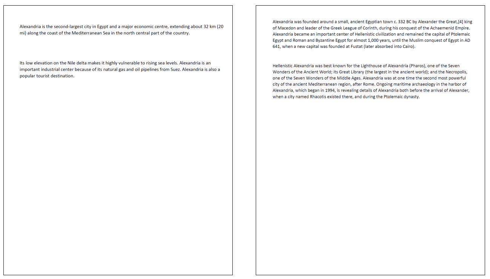

## Description

This model obtain the text of an input PDF document.

## Predicted Entities

{:.btn-box}
<button class="button button-orange" disabled>Live Demo</button>
[Open in Colab](https://github.com/JohnSnowLabs/spark-ocr-workshop/blob/master/tutorials/Certification_Trainings/2.1.Pdf_processing.ipynb){:.button.button-orange.button-orange-trans.co.button-icon}
<button class="button button-orange" disabled>Download</button>

## How to use


<div class="tabs-box" markdown="1">


```python
    
    from pyspark.ml import PipelineModel
    from sparkocr.transformers import *
    
    pdfPath = "path to pdf"
    pdf_df = spark.read.format("binaryFile").load(pdfPath)
    
    pdf_to_text = PdfToText() \
        .setInputCol("content") \
        .setOutputCol("text") \
        .setSplitPage(True) \
        .setExtractCoordinates(True) \
        .setStoreSplittedPdf(True)
    
    pdf_to_image = PdfToImage() \
        .setInputCol("content") \
        .setOutputCol("image") \
        .setKeepInput(True)
    
    ocr = ImageToText() \
        .setInputCol("image") \
        .setOutputCol("text") \
        .setConfidenceThreshold(60)

    pipeline = PipelineModel(stages=[
        pdf_to_text,
        pdf_to_image,
        ocr

    result = pipeline().transform(pdf_df).cache()
```
```scala
import com.johnsnowlabs.ocr.transformers.*
import com.johnsnowlabs.ocr.OcrContext.implicits._

val imagePath = "path to image"
var dataFrame = spark.read.format("binaryFile").load(imagePath)

val pdfToImage = new PdfToImage()
  .setInputCol("content")
  .setOutputCol("image_raw")
  .setResolution(400)
  .setKeepInput(true)
  
val binarizer = new ImageBinarizer()
  .setInputCol("image_raw")
  .setOutputCol("image")
  .setThreshold(130)
  
val ocr = new ImageToText()
  .setInputCol("image")
  .setOutputCol("text")
  .setIgnoreResolution(false)
  .setPageSegMode(PageSegmentationMode.SPARSE_TEXT)

val pipeline = new Pipeline()
  .setStages(Array(
    pdfToImage,
    binarizer,
    ocr,
  ))
  
val result = transformer.transform(dataFrame).select("text", "transformed_image").cache()
```
</div>

## Example

### Input:


### Output:
```bash
+--------------------+-------------------+------+--------------------+--------------------+-----------------+------------------+--------------------+--------------------+-----------+-------+-----------+----------------+---------+
|                path|   modificationTime|length|                text|           positions| height_dimension|   width_dimension|             content|               image|total_pages|pagenum|documentnum|      confidence|exception|
+--------------------+-------------------+------+--------------------+--------------------+-----------------+------------------+--------------------+--------------------+-----------+-------+-----------+----------------+---------+
|file:/Users/nmeln...|2022-07-14 15:38:51| 70556|Alexandria is the...|[{[{A, 0, 72.024,...|            792.0|             612.0|[25 50 44 46 2D 3...|                null|       null|      0|          0|            null|     null|
|file:/Users/nmeln...|2022-07-14 15:38:51| 70556|Alexandria was fo...|[{[{A, 1, 72.024,...|            792.0|             612.0|[25 50 44 46 2D 3...|                null|       null|      0|          0|            null|     null|
+--------------------+-------------------+------+--------------------+--------------------+-----------------+------------------+--------------------+--------------------+-----------+-------+-----------+----------------+---------+
```
```bash
text
0	Alexandria is the second-largest city in Egypt and a major economic centre, extending about 32 km (20 mi) along the coast of the Mediterranean Sea in the north central part of the country. Its low elevation on the Nile delta makes it highly vulnerable to rising sea levels. Alexandria is an important industrial center because of its natural gas and oil pipelines from Suez. Alexandria is also a popular tourist destination.
1	Alexandria was founded around a small, ancient Egyptian town c. 332 BC by Alexander the Great,[4] king of Macedon and leader of the Greek League of Corinth, during his conquest of the Achaemenid Empire. Alexandria became an important center of Hellenistic civilization and remained the capital of Ptolemaic Egypt and Roman and Byzantine Egypt for almost 1,000 years, until the Muslim conquest of Egypt in AD 641, when a new capital was founded at Fustat (later absorbed into Cairo). Hellenistic Alexandria was best known for the Lighthouse of Alexandria (Pharos), one of the Seven Wonders of the Ancient World; its Great Library (the largest in the ancient world); and the Necropolis, one of the Seven Wonders of the Middle Ages. Alexandria was at one time the second most powerful city of the ancient Mediterranean region, after Rome. Ongoing maritime archaeology in the harbor of Alexandria, which began in 1994, is revealing details of Alexandria both before the arrival of Alexander, when a city named Rhacotis existed there, and during the Ptolemaic dynasty.
```
