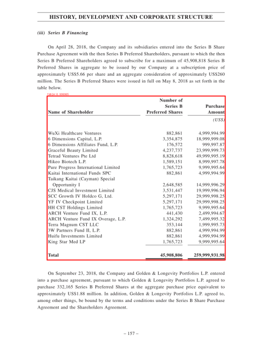

## Description

This model shows the capabilities for table recognition and free-text extraction using OCR techniques.
For table recognition is proposed a CascadTabNet model. CascadTabNet is an automatic table recognition method for interpretation of tabular data in document images.


## Predicted Entities

{:.btn-box}
<button class="button button-orange" disabled>Live Demo</button>
[Open in Colab](https://github.com/JohnSnowLabs/spark-ocr-workshop/blob/master/tutorials/Certification_Trainings/2.2.Spark_OCR_training_Table_recognition.ipynb){:.button.button-orange.button-orange-trans.co.button-icon}
<button class="button button-orange" disabled>Download</button>

## How to use


<div class="tabs-box" markdown="1">


```python
    
    from pyspark.ml import PipelineModel
    from sparkocr.transformers import *

    imagePath = "path to image"
    bin_df = spark.read.format("binaryFile").load(imagePath)

    # TABLE DATA EXTRACTION
    binary_to_image = BinaryToImage()
    
    # Detect tables on the page using pretrained model
    table_detector = ImageTableDetector.pretrained("general_model_table_detection_v2", "en", "clinical/ocr")
    table_detector.setInputCol("image")
    table_detector.setOutputCol("region")
    
    # Draw detected region's with table to the page
    draw_regions = ImageDrawRegions()
    draw_regions.setInputCol("image")
    draw_regions.setInputRegionsCol("region")
    draw_regions.setOutputCol("image_with_regions")
    draw_regions.setRectColor(Color.red)
    
    # Extract table regions to separate images
    splitter = ImageSplitRegions()
    splitter.setInputCol("image")
    splitter.setInputRegionsCol("region")
    splitter.setOutputCol("table_image")
    splitter.setDropCols("image")
    
    # Detect cells on the table image
    cell_detector = ImageTableCellDetector()
    cell_detector.setInputCol("table_image")
    cell_detector.setOutputCol("cells")
    cell_detector.setAlgoType("morphops")
    cell_detector.setDrawDetectedLines(True)
    
    # Extract text from the detected cells 
    table_recognition = ImageCellsToTextTable()
    table_recognition.setInputCol("table_image")
    table_recognition.setCellsCol('cells')
    table_recognition.setMargin(3)
    table_recognition.setStrip(True)
    table_recognition.setOutputCol('table')
    
    # Erase detected table regions
    fill_regions = ImageDrawRegions()
    fill_regions.setInputCol("image")
    fill_regions.setInputRegionsCol("region")
    fill_regions.setOutputCol("image_1")
    fill_regions.setRectColor(Color.white)
    fill_regions.setFilledRect(True)
    
    # OCR
    ocr = ImageToText()
    ocr.setInputCol("image_1")
    ocr.setOutputCol("text")
    ocr.setOcrParams(["preserve_interword_spaces=1", ])
    ocr.setKeepLayout(True)
    ocr.setOutputSpaceCharacterWidth(8)
    
    pipeline_table = PipelineModel(stages=[
        binary_to_image,
        table_detector,
        draw_regions,
        fill_regions,
        splitter,
        cell_detector,
        table_recognition,
        ocr
    ])
    
    tables_results = pipeline_table.transform(df).cache()
```
```scala
```
</div>

## Result



```bash
+--------------------+--------------------+--------------------+--------------------+-------+--------------------+--------------------+--------------------+------+--------------------+--------------------+--------------------+-----------------+---------+--------------------+--------------------+
|         table_image|              region|  image_with_regions|             image_1|pagenum|    modificationTime|                path|               image|length|               cells|        output_image|               table|       confidence|exception|                text|           positions|
+--------------------+--------------------+--------------------+--------------------+-------+--------------------+--------------------+--------------------+------+--------------------+--------------------+--------------------+-----------------+---------+--------------------+--------------------+
|{file:/content/cT...|{0, 0, 214.0, 437...|{file:/content/cT...|{file:/content/cT...|      0|2022-09-28 18:54:...|file:/content/cTD...|{file:/content/cT...|385071|[[[[0, 0, 408, 32...|{file:/content/cT...|{{0, 0, 0.0, 0.0,...|95.43954744611467|     null|                 ...|[{[{ , 0, 170.0, ...|
+--------------------+--------------------+--------------------+--------------------+-------+--------------------+--------------------+--------------------+------+--------------------+--------------------+--------------------+-----------------+---------+--------------------+--------------------+
```
