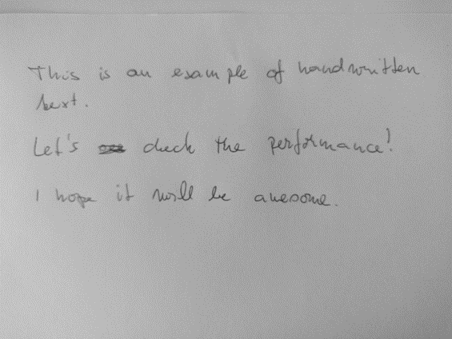
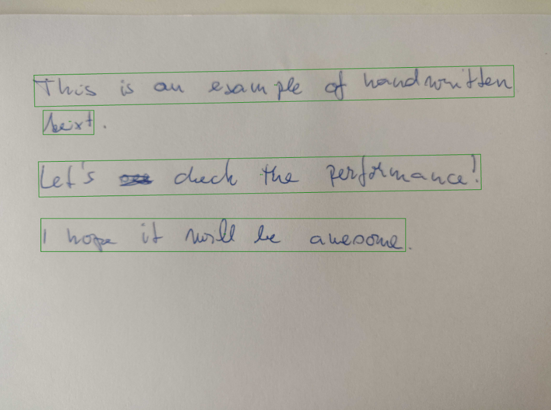

## Description

Ocr base handwritten model v2 for recognise handwritten text based on TrOCR architecture and handwritten datasets. It is an Ocr base model for recognise handwritten text based on TrOcr architecture.  The TrOCR model was proposed in TrOCR: Transformer-based Optical Character Recognition with Pre-trained Models by Minghao Li, Tengchao Lv, Lei Cui, Yijuan Lu, Dinei Florencio, Cha Zhang, Zhoujun Li, Furu Wei. TrOCR consists of an image Transformer encoder and an autoregressive text Transformer decoder to perform optical character recognition (OCR).  The abstract from the paper is the following:  Text recognition is a long-standing research problem for document digitalization. Existing approaches for text recognition are usually built based on CNN for image understanding and RNN for char-level text generation. In addition, another language model is usually needed to improve the overall accuracy as a post-processing step. In this paper, we propose an end-to-end text recognition approach with pre-trained image Transformer and text Transformer models, namely TrOCR, which leverages the Transformer architecture for both image understanding and wordpiece-level text generation. The TrOCR model is simple but effective, and can be pre-trained with large-scale synthetic data and fine-tuned with human-labeled datasets. Experiments show that the TrOCR model outperforms the current state-of-the-art models on both printed and handwritten text recognition tasks.

## Predicted Entities

{:.btn-box}
<button class="button button-orange" disabled>Live Demo</button>
[Open in Colab](https://colab.research.google.com/github/JohnSnowLabs/spark-ocr-workshop/blob/master/jupyter/Cards/SparkOcrImageToTextHandwritten_V2.ipynb){:.button.button-orange.button-orange-trans.co.button-icon}
[Download](https://s3.amazonaws.com/auxdata.johnsnowlabs.com/clinical/ocr/ocr_base_handwritten_v2_en_4.2.2_3.0_1670602309000.zip){:.button.button-orange.button-orange-trans.arr.button-icon}


## How to use

<div class="tabs-box" markdown="1">


```python
from pyspark.ml import PipelineModel
from sparkocr.transformers import *

imagePath = "path to image"
image_df = spark.read.format("binaryFile").load(imagePath)

binary_to_image = BinaryToImage() 
binary_to_image.setImageType(ImageType.TYPE_3BYTE_BGR)

text_detector = ImageTextDetectorV2 \
    .pretrained("image_text_detector_v2", "en", "clinical/ocr") \
    .setInputCol("image") \
    .setOutputCol("text_regions") \
    .setWithRefiner(True) \
    .setSizeThreshold(-1) \
    .setLinkThreshold(0.3) \
    .setWidth(500)

ocr = ImageToTextV2Opt.pretrained("ocr_base_handwritten_v2", "en", "clinical/ocr") \
    .setInputCols(["image", "text_regions"]) \
    .setGroupImages(True) \
    .setOutputCol("text") \
    .setRegionsColumn("text_regions")

draw_regions = ImageDrawRegions() \
    .setInputCol("image") \
    .setInputRegionsCol("text_regions") \
    .setOutputCol("image_with_regions") \
    .setRectColor(Color.green) \
    .setRotated(True)

pipeline = PipelineModel(stages=[
    binary_to_image,
    text_detector,
    ocr,
    draw_regions
])

result = pipeline.transform(image_df).cache()
display_images(result, "image_with_regions")
print(("").join([x.text for x in result.select("text").collect()]))
```
```scala
import com.johnsnowlabs.ocr.transformers.*
import com.johnsnowlabs.ocr.OcrContext.implicits._

val imagePath = "path to image"
val imageDf = spark.read.format("binaryFile").load(imagePath)

val regionsPath = "./python/sparkocr/resources/ocr/text_detection/regions.parquet"
val regionsDf = spark.read.parquet(regionsPath)

val imageWithRegions = regionsDf.join(imageDf)

val binaryToImage = new BinaryToImage().
  setOutputCol("image")

val ocr = ImageToTextOnnx.
  pretrained("ocr_base_handwritten_v2")
   .setInputCols(Array("image"))
   .setRegionsColumn("text_regions")
   .setOutputFormat("text")

val pipeline = new Pipeline()
   .setStages(Array(binaryToImage, ocr))
  .fit(imageWithRegions)

val r = Benchmark.time("Using ocr_base_handwritten_v2",true) {
  pipeline.transform(imageWithRegions).select("text").collect()
}
assert(r.head.getString(0).contains("performance"))
assert(r.head.getString(0).contains("handwritten"))
assert(r.head.getString(0).contains("hope"))
assert(r.head.getString(0).length > 90)
```
</div>

## Example

### Input:


### Output:

```bash
This is an example of handwritten
beerxt
Let's # check the performance !
I hope it will be awesome
```


