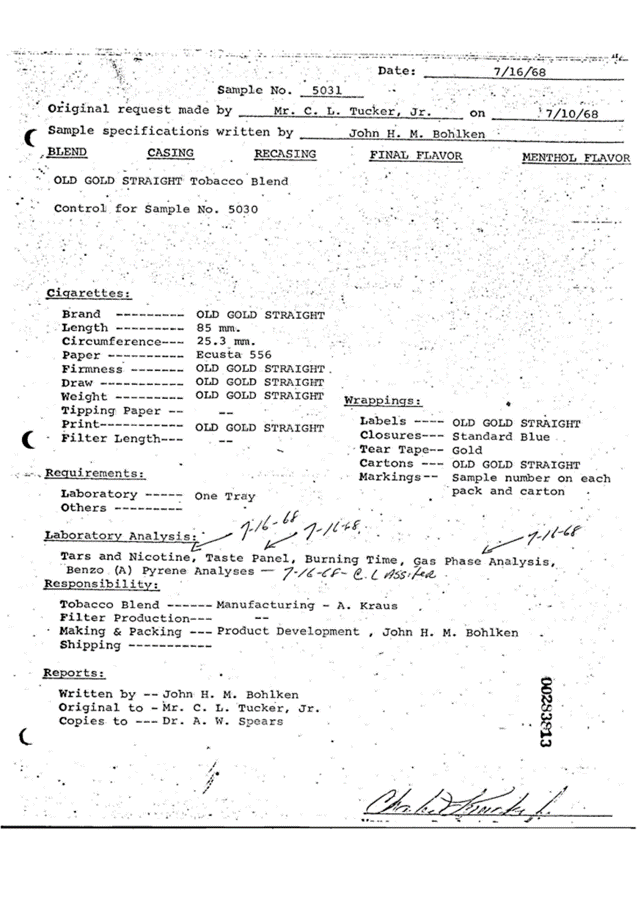
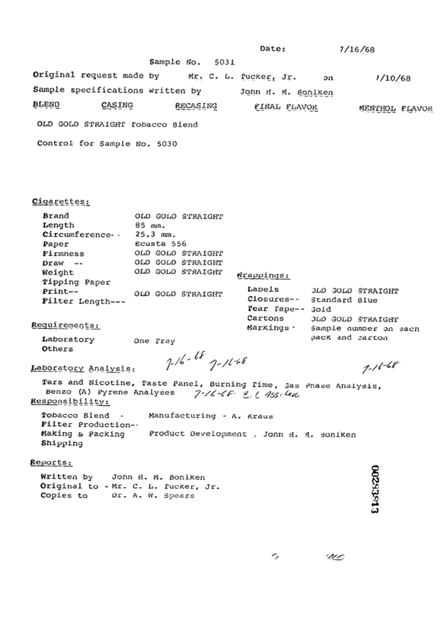

## Description

Model for cleaning image with text. It is based on text detection model with extra post-processing.

## Predicted Entities


{:.btn-box}
<button class="button button-orange" disabled>Live Demo</button>
[Open in Colab](https://github.com/JohnSnowLabs/spark-ocr-workshop/blob/master/jupyter/Cards/SparkOcrImageCleaner.ipynb){:.button.button-orange.button-orange-trans.co.button-icon}
[Download](https://s3.amazonaws.com/auxdata.johnsnowlabs.com/clinical/ocr/text_cleaner_v1_en_3.0.0_2.4_1640088709401.zip){:.button.button-orange.button-orange-trans.arr.button-icon}


## How to use
<div class="tabs-box" markdown="1">


```python
from pyspark.ml import PipelineModel
from sparkocr.transformers import *

pdf_example = "path to pdf"
pdf_example_df = spark.read.format("binaryFile").load(pdf_example).cache()

pdf_to_image = PdfToImage() \
    .setInputCol("content") \
    .setOutputCol("image") \
    .setResolution(300)

ocr = ImageToText() \
    .setInputCol("image") \
    .setOutputCol("text") \
    .setConfidenceThreshold(70) \
    .setIgnoreResolution(False)

cleaner = ImageTextCleaner \
    .pretrained("text_cleaner_v1", "en", "clinical/ocr") \
    .setInputCol("image") \
    .setOutputCol("corrected_image") \
    .setMedianBlur(0) \
    .setSizeThreshold(10) \
    .setTextThreshold(0.3) \
    .setLinkThreshold(0.2) \
    .setPadding(5) \
    .setBinarize(False)

ocr_corrected = ImageToText() \
    .setInputCol("corrected_image") \
    .setOutputCol("corrected_text") \
    .setConfidenceThreshold(70) \
    .setIgnoreResolution(False)

pipeline = PipelineModel(stages=[
    pdf_to_image,
    ocr,
    cleaner,
    ocr_corrected
])

results = pipeline.transform(pdf_example_df).cache()
print(f"Detected text:\n{results.select('text').collect()[0].text}")
```
```scala
import com.johnsnowlabs.ocr.transformers.*
import com.johnsnowlabs.ocr.OcrContext.implicits._

val imagePath = "path to image"
val imgDf = spark.read.format("binaryFile").load(imagePath)
val bin2imTransformer = new BinaryToImage()
bin2imTransformer.setImageType(ImageType.TYPE_3BYTE_BGR)
val dataFrame = bin2imTransformer.transform(imgDf)

val textDetector = ImageTextCleaner
  .pretrained("text_cleaner_v1", "en", "clinical/ocr")
  .setInputCol("image")
  .setOutputCol("cleaned_image")
  .setSizeThreshold(5)
  .setTextThreshold(0.4)
  .setLinkThreshold(0.4)
  .setPadding(10)
  .setMedianBlur(3)
  .setBinarize(true)
  .setWidth(960)
  .setHeight(1280)

val ocr = new ImageToText()
  .setInputCol("cleaned_image")
  .setOutputCol("text")
  .setIgnoreResolution(false)

val pipeline = new Pipeline()
pipeline.setStages(Array(
  textDetector,
  ocr
))

val modelPipeline = pipeline.fit(dataFrame)
val transformed = modelPipeline.transform(dataFrame).select("text")

val text = transformed.select("text").limit(10).collect().map(_.getString(0)).mkString("")
```
</div>


## Example

### Input:


### Output:


```bash
Detected text:
 

 

 

Sample specifications written by
 , BLEND CASING RECASING

- OLD GOLD STRAIGHT Tobacco Blend

Control for Sample No. 5030

Cigarettes:

OLD GOLD STRAIGHT

 

John H. M. Bohlken

FINAL FLAVOR MENTHOL FLAVOR

Tars and Nicotine, Taste Panel, Burning Time, Gas Phase Analysis,
Benzo (A) Pyrene Analyses — T/C -CF~ O.C S51: Fee -

Written by -- John H. M. Bohlken
Original to -Mr. C. L. Tucker, dr.
Copies to ---Dr. A. W. Spears

C

~
```


{:.model-param}
## Model Information

{:.table-model}
|---|---|
|Model Name:|text_cleaner_v1|
|Type:|ocr|
|Compatibility:|Visual NLP 4.1.0+|
|License:|Licensed|
|Edition:|Official|
|Language:|en|
|Size:|77.1 MB|
