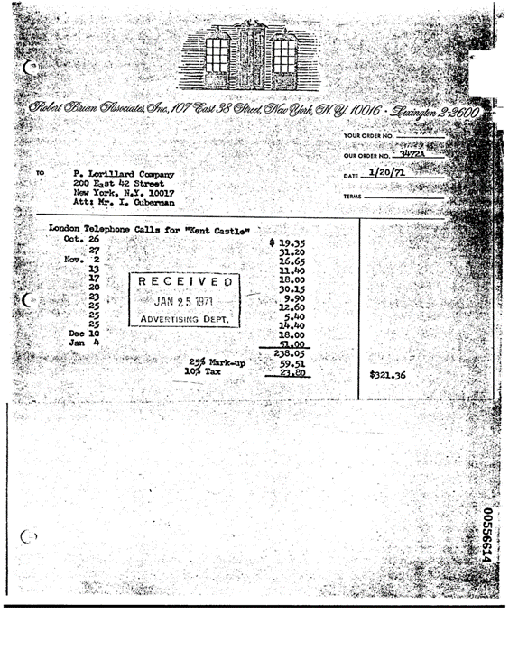

## Description

Document Image Transformer (DiT) model for document classification. The model was pretrained on IIT-CDIP dataset that includes 42 million document images and finetuned on RVL-CDIP dataset that consists of 400 000 grayscale images in 16 classes.

The DiT is a transformer encoder model (BERT-like) pre-trained on a large collection of images in a self-supervised fashion. The pre-training objective for the model is to predict visual tokens from the encoder of a discrete VAE (dVAE), based on masked patches.

## Predicted Entities

`letter`, `form`, `email`, `handwritten`, `advertisement`, `scientific report`, `scientific publication`, `specification`, `file folder`, `news article`, `budget`, `invoice`, `presentation`, `questionnaire`, `resume`, `memo`

{:.btn-box}
<button class="button button-orange" disabled>Live Demo</button>
[Open in Colab](https://colab.research.google.com/github/JohnSnowLabs/spark-ocr-workshop/blob/master/tutorials/Certification_Trainings/5.2.Visual_Document_Classifier_v3.ipynb){:.button.button-orange.button-orange-trans.co.button-icon}
[Download](https://s3.amazonaws.com/auxdata.johnsnowlabs.com/clinical/ocr/dit_base_finetuned_rvlcdip_en_3.3.0_2.4_1655036470277.zip){:.button.button-orange.button-orange-trans.arr.button-icon}

## How to use


<div class="tabs-box" markdown="1">

```python

    from pyspark.ml import PipelineModel
    from sparkocr.transformers import *

    imagePath = "path to image"
    bin_df = spark.read.format("binaryFile").load(imagePath).limit(50)

    binary_to_image = BinaryToImage()\
        .setOutputCol("image") \
        .setImageType(ImageType.TYPE_3BYTE_BGR)
    
    doc_class = VisualDocumentClassifierV3() \
        .pretrained("dit_base_finetuned_rvlcdip", "en", "clinical/ocr") \
        .setInputCols(["image"]) \
        .setOutputCol("label")
    
    # OCR pipeline
    pipeline = PipelineModel(stages=[
        binary_to_image,
        doc_class
    ])

    results = pipeline.transform(bin_df).cache()
    results.select(["label"]).show(50, truncate=False)
```
```scala
import com.johnsnowlabs.ocr.transformers.*
import com.johnsnowlabs.ocr.OcrContext.implicits._

val imagePath = "path to image"
var dataFrame = spark.read.format("binaryFile").load(imagePath)

var bin2imTransformer = new BinaryToImage()
bin2imTransformer.setImageType(ImageType.TYPE_3BYTE_BGR)

val visualDocumentClassifier = VisualDocumentClassifierv3
    .pretrained("dit_base_finetuned_rvlcdip", "en", "clinical/ocr")
    .setInputCols(Array("image"))

val pipeline = new Pipeline()
  .setStages(Array(
    bin2imTransformer,
    visualDocumentClassifier
  ))

val results = pipeline
  .fit(dataFrame)
  .transform(dataFrame)
  .select("label")
  .cache()
```
</div>

## Example

### Input:


### Output:
```bash
+-------+
|label  |
+-------+
|invoice|
+-------+
```

{:.model-param}
## Model Information

{:.table-model}
|---|---|
|Model Name:|dit_base_finetuned_rvlcdip|
|Type:|ocr|
|Compatibility:|Visual NLP 3.3.0+|
|License:|Licensed|
|Edition:|Official|
|Language:|en|
|Size:|319.6 MB|

## References

IIT-CDIP, RVL-CDIP
