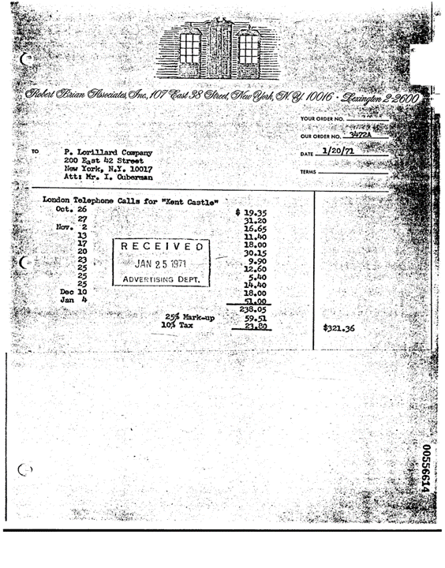

## Description

This model uses LayoutLMv2 to classify documents using text and layout data. Currently available pretrained model on the RVL-CDIP dataset, that contains 400K images belonging to 16 different classes (advertisement, budget, email, file_folder, form, handwritten, invoice, letter, memo, news_article, presentation, questionnaire, resume, scientific_publication, scientific_report, specification)

## Predicted Entities

`advertisement`, `budget`, `email`, `file_folder`, `form`, `handwritten`, `invoice`, `letter`, `memo`, `news_article`, `presentation`, `questionnaire`, `resume`, `scientific_publication`, `scientific_report`, `specification`

{:.btn-box}
<button class="button button-orange" disabled>Live Demo</button>
[Open in Colab](https://colab.research.google.com/github/JohnSnowLabs/spark-ocr-workshop/blob/master/tutorials/Certification_Trainings/5.1.Visual_Document_Classifier_v2.ipynb){:.button.button-orange.button-orange-trans.co.button-icon}
[Download](https://s3.amazonaws.com/auxdata.johnsnowlabs.com/clinical/ocr/layoutlmv2_rvl_cdip_40k_en_3.14.0_3.0_1658336853162.zip){:.button.button-orange.button-orange-trans.arr.button-icon}

## How to use


<div class="tabs-box" markdown="1">

```python
    
    from pyspark.ml import PipelineModel
    from sparkocr.transformers import *
    
    imagePath = "path to image"
    bin_df = spark.read.format("binaryFile").load(imagePath)
    
    binary_to_image = BinaryToImage()\
        .setOutputCol("image") \
        .setImageType(ImageType.TYPE_3BYTE_BGR)
    
    img_to_hocr = ImageToHocr()\
        .setInputCol("image")\
        .setOutputCol("hocr")\
        .setIgnoreResolution(False)\
        .setOcrParams(["preserve_interword_spaces=0"])
    
    tokenizer = HocrTokenizer()\
        .setInputCol("hocr")\
        .setOutputCol("token")
    
    doc_class = VisualDocumentClassifierV2() \
        .pretrained("layoutlmv2_rvl_cdip_40k", "en", "clinical/ocr") \
        .setInputCols(["token", "image"]) \
        .setOutputCol("label")
    
    # OCR pipeline
    pipeline = PipelineModel(stages=[
        binary_to_image,
        img_to_hocr,
        tokenizer,
        doc_class
    ])
    
    results = pipeline.transform(bin_df).cache()
    results.select(["label"]).show(50, truncate=False)
```
```scala
import com.johnsnowlabs.ocr.transformers.*
import com.johnsnowlabs.ocr.OcrContext.implicits._

val imagePath = "path to image"
var dataFrame = spark.read.format("binaryFile").load(imagePath)

var bin2imTransformer = new BinaryToImage()
bin2imTransformer.setImageType(ImageType.TYPE_3BYTE_BGR)

val ocr = new ImageToHocr()
  .setInputCol("image")
  .setOutputCol("hocr")
  .setIgnoreResolution(false)
  .setOcrParams(Array("preserve_interword_spaces=0"))

val tokenizer = new HocrTokenizer()
  .setInputCol("hocr")
  .setOutputCol("token")

val visualDocumentClassifier = VisualDocumentClassifierv2
    .pretrained("layoutlmv2_rvl_cdip_40k", "en", "clinical/ocr")
    .setInputCols(Array("token", "image"))

val pipeline = new Pipeline()
  .setStages(Array(
    bin2imTransformer,
    ocr,
    tokenizer,
    visualDocumentClassifier
  ))

val results = pipeline
  .fit(dataFrame)
  .transform(dataFrame)
  .select("label", "exception")
  .cache()


```
</div>

## Example

### Input:


### Output:
```bash
+-------+
|label  |
+-------+
|invoice|
+-------+
```

{:.model-param}
## Model Information

{:.table-model}
|---|---|
|Model Name:|layoutlmv2_rvl_cdip_40k|
|Type:|ocr|
|Compatibility:|Visual NLP 3.14.0+|
|License:|Licensed|
|Edition:|Official|
|Language:|en|
|Size:|1.1 GB|

## References

RVL-CDIP (Ryerson Vision Lab Complex Document Information Processing) dataset consisting of 400 000 grayscale images in 16 classes

## Benchmarking

```bash
Accuracy 88% on TEST part of RVL-CDIP dataset
```
